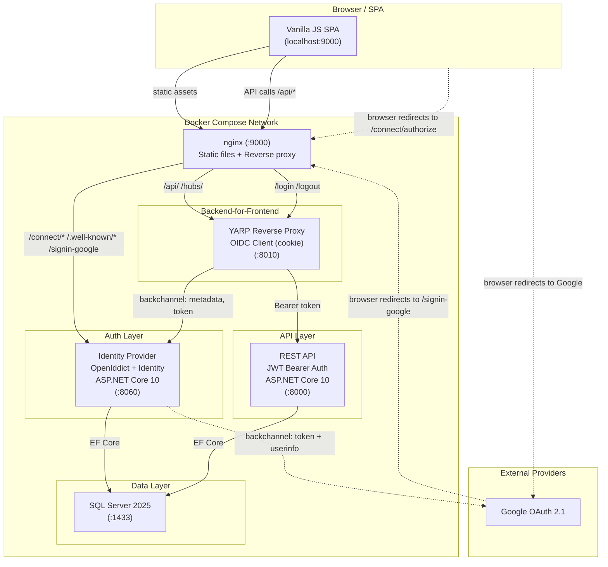
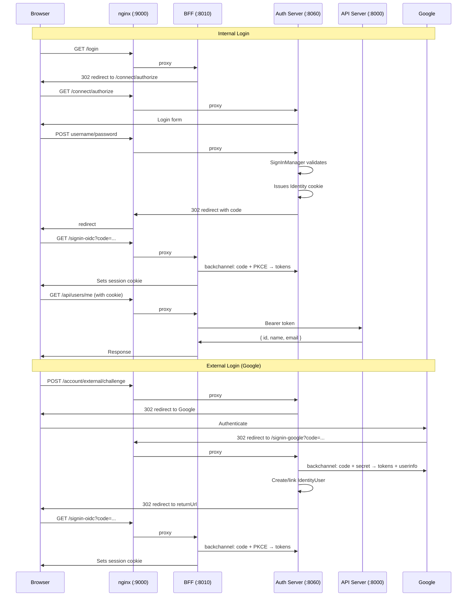
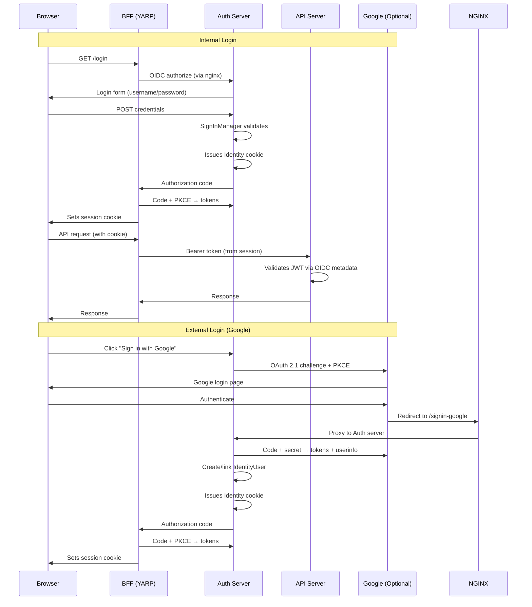

# Promise Model Online

Enterprise project-management SaaS platform built on ASP.NET Core 10 with OpenID Connect (OpenIddict) and OAuth 2.1 / OIDC-compliant authentication.

---

## Architecture



---

## Authentication Flow



---

## Authentication Flow



---

## Services

| Service | Container | Port | Framework | Purpose |
|---|---|---|---|---|
| **Client** | `promisemodelonlineclient` | `:9000` | nginx + Vanilla JS | SPA static file server, reverse proxy |
| **BFF** | `promisemodelonlinebff` | `:8010` | ASP.NET Core 10 + YARP | OIDC client + reverse proxy |
| **Auth** | `promisemodelonlineauth` | `:8060` | ASP.NET Core 10 + OpenIddict | OIDC identity provider |
| **API** | `promisemodelonlineapi` | `:8000` | ASP.NET Core 10 | Resource server |
| **DB** | `promisemodelonlinedb` | `:1433` | SQL Server 2025 | Persistent storage |

---

## Authentication Standards

- **OAuth 2.1** — Authorization code flow with PKCE; no implicit grant; confidential clients only
- **OpenID Connect** — Standardized ID tokens, UserInfo endpoint, `openid` scope enforcement
- **External Provider** — Google OAuth 2.1 (optional, enabled when `AUTH_GOOGLE_CLIENT_ID` is set)

### Token Lifetimes

| Token | Lifetime |
|---|---|
| Authorization code | 10 minutes |
| Access token | 15 minutes |
| Refresh token | 7 days |

---

## Getting Started

### Prerequisites

- .NET 10.0 SDK
- Docker Desktop (or Docker Compose)
- OpenSSL (for generating secrets)

### 1. Clone and build

```bash
git clone <repo-url>
cd Promise-Model-Online
dotnet restore
dotnet build
```

### 2. Generate secrets

```bash
mkdir -p secrets

# Database passwords (URL-safe, no special chars)
openssl rand -base64 24 | tr '+/' '-_' | tee secrets/auth_db_password.txt
openssl rand -base64 24 | tr '+/' '-_' | tee secrets/api_db_password.txt

# Google OAuth (paste from Google Cloud Console — not generated via OpenSSL)
# echo 'your-client-secret' > secrets/google_client_secret.txt
```

> **Note:** Only `secrets/*.txt` files are gitignored. Example templates (`.example.txt`) are committed for documentation.

### 3. Configure environment

Set the public Google client ID in your environment:

```bash
export AUTH_GOOGLE_CLIENT_ID=your-client-id.apps.googleusercontent.com
```

Register the redirect URI in Google Cloud Console (**port 9000 — through nginx**):
```
https://localhost:9000/signin-google
```

### 4. Run

```bash
docker compose up --build
```

The application is available at `https://localhost:9000`.

---

## Secret Management

Secrets are stored as files in `./secrets/` and mounted into containers as Docker secrets at `/run/secrets/<name>`. They are **never** set as environment variable values in `docker-compose.yml`.

| Secret | File | Used By |
|---|---|---|
| Auth DB password | `secrets/auth_db_password.txt` | Auth connection string |
| API DB password | `secrets/api_db_password.txt` | API connection string |
| Google client secret | `secrets/google_client_secret.txt` | Auth (Google OAuth) |

**Non-secrets** (plain environment variables):
- `AUTH_GOOGLE_CLIENT_ID` — public OAuth identifier
- `PMO_API_DB_USER`, `PMO_AUTH_DB_USER` — database usernames
- `AUTH__REG_KEY` — registration key (optional, Swagger only)
- `JWT__KEY` — JWT key (unused, reserved)

**Resolution order** for DB passwords (via `ConnectionStringExtensions.ResolveSecrets()`):
1. The connection string contains `Password_FILE=/run/secrets/<name>`
2. `ResolveSecrets()` reads the file at that path
3. If the file doesn't exist or is empty → throws `InvalidOperationException` (fail-fast)

---

## Development

### Running without Docker

```bash
# For non-Docker dev, set secrets as environment variables:
export AUTH_GOOGLE_CLIENT_ID=...
export AUTH_GOOGLE_CLIENT_SECRET=...
export PMO_AUTH_DB_PASSWORD=...
export PMO_API_DB_PASSWORD=...

# Auth server
dotnet run --project PromiseModelOnline.Auth

# API server
dotnet run --project PromiseModelOnline.Api

# BFF
dotnet run --project PromiseModelOnline.BFF
```

### Testing

```bash
dotnet test PromiseModelOnline.Auth.Tests
dotnet test PromiseModelOnline.Api.Tests
```

### CI/CD Pipeline

The project uses GitHub Actions for CI/CD. Pipelines run on every push:

1. **Build** — `dotnet build --configuration Release`
2. **Unit tests** — Auth, API, and Client test suites (NUnit + Selenium)
3. **Integration tests** — Auth integration tests against a real database
4. **Smoke test** — Full `docker compose up` with health checks for all 6 services
5. **Push** — Images tagged `latest` and pushed to Docker Hub (main branch only)

Secrets are injected at runtime via GitHub Secrets, never baked into images.

---

## Project Structure

```
Promise-Model-Online/
├── PromiseModelOnline.Auth/        # OpenIddict identity provider
│   ├── Controllers/                # Login, Authorization, ExternalLogin
│   ├── Extensions/                 # OpenIddict config, connection string resolvers
│   ├── Middleware/                 # Forwarded headers, security headers
│   ├── Views/                      # Razor login/register pages
│   └── wwwroot/                    # Auth server CSS/JS
├── PromiseModelOnline.Api/         # REST API resource server
│   ├── BusinessLogic/              # Domain services, automation
│   ├── Controllers/                # API endpoints
│   ├── DAL/                        # EF Core DbContext, repositories
│   └── Extensions/                 # DI registration, seeders, connection string resolvers
├── PromiseModelOnline.BFF/         # YARP reverse proxy + OIDC client
├── PromiseModelOnline.Client/      # nginx + Vanilla JS SPA
│   └── wwwroot/
│       ├── css/
│       ├── js/
│       │   ├── strides/
│       │   ├── navigation/
│       │   └── utils/
│       └── templates/
├── PromiseModelOnline.Auth.Tests/  # Auth server tests (NUnit)
├── PromiseModelOnline.Api.Tests/   # API tests (NUnit)
├── PromiseModelOnline.Client.Tests/ # UI tests (Selenium)
├── db/init/                        # Database initialization scripts
│   └── run-init.sh                 # Creates databases, logins, users
├── secrets/                        # Local secret files (gitignored)
├── .github/workflows/              # CI/CD pipelines
├── docker-compose.yml              # Service orchestration
└── .env                            # Non-sensitive environment defaults
```
