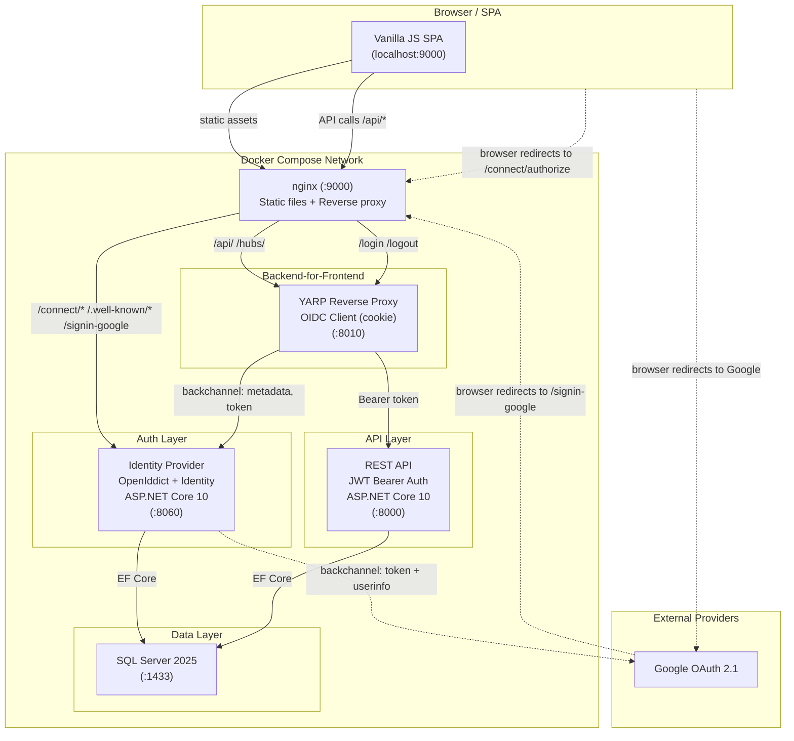
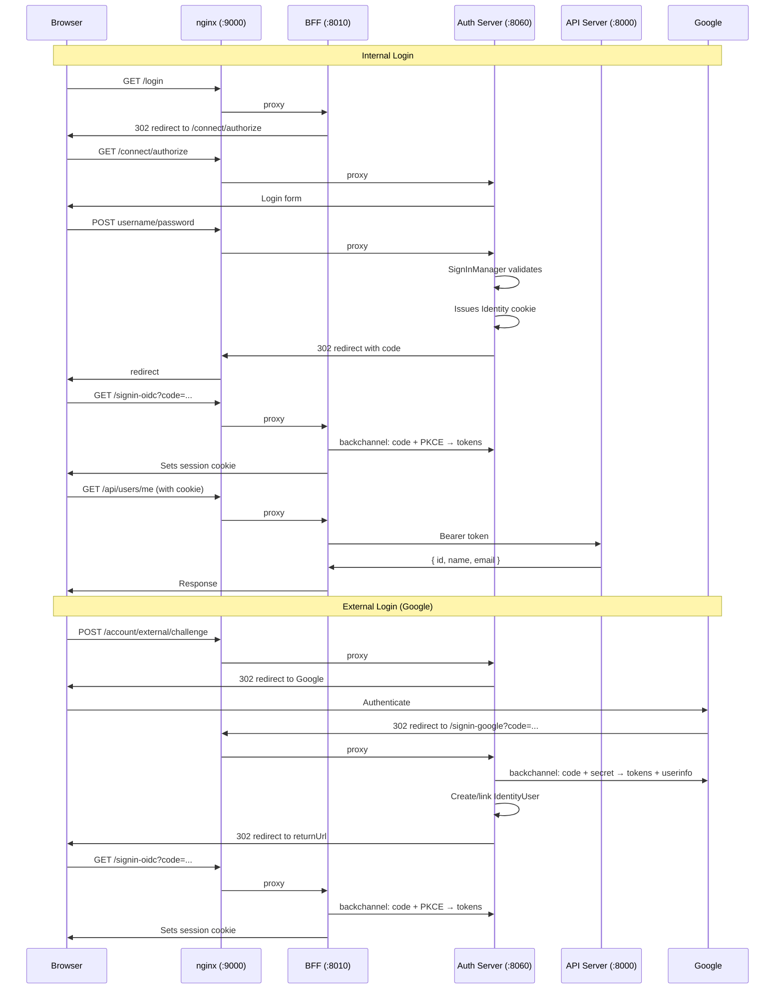

# Promise Model Online

Enterprise project-management SaaS platform built on ASP.NET Core 10 with OpenID Connect (OpenIddict) and OAuth 2.1 / OIDC-compliant authentication.

---

## Architecture



---

## Authentication Flow



---

## Services

| Service | Container | Port | Framework | Purpose |
|---|---|---|---|---|
| **Client** | `promisemodelonlineclient` | `:9000` | nginx + Vanilla JS | SPA static file server, reverse proxy |
| **BFF** | `promisemodelonlinebff` | `:8010` | ASP.NET Core 10 + YARP | OIDC client + reverse proxy |
| **Auth** | `promisemodelonlineauth` | `:8060` | ASP.NET Core 10 + OpenIddict | OIDC identity provider |
| **API** | `promisemodelonlineapi` | `:8000` | ASP.NET Core 10 | Resource server |
| **DB** | `promisemodelonlinedb` | `:1433` | SQL Server 2025 | Persistent storage |

---

## Authentication Standards

- **OAuth 2.1** — Authorization code flow with PKCE; no implicit grant; confidential clients only
- **OpenID Connect** — Standardized ID tokens, UserInfo endpoint, `openid` scope enforcement
- **External Provider** — Google OAuth 2.1 (optional, enabled when `AUTH_GOOGLE_CLIENT_ID` is set)

### Token Lifetimes

| Token | Lifetime |
|---|---|
| Authorization code | 10 minutes |
| Access token | 15 minutes |
| Refresh token | 7 days |

---

## Features

### PWA (Progressive Web App)
Full offline-capable PWA with service worker, web manifest, installable on desktop and mobile. Static assets are cache-first, templates are network-first, and all BFF/auth paths are network-only (never cached).

### Privacy & Compliance
- **Privacy Policy** at `/privacy` — GDPR, PIPEDA, and CCPA/CPRA compliant
- **Terms of Service** at `/tos`
- **Data Export** — `GET /api/users/me/export` downloads all personal data (profile, projects, comments, reactions, notifications, permissions, moment assignments) as machine-readable JSON
- **Account Deletion** — `DELETE /account/me` with password confirmation; SPA page at `/account/delete`
- **Right to be forgotten** — hard-deletes the Identity user and revokes all OpenIddict tokens
- Licensed under **GPL-3.0**

### Analytics (Optional)
Self-hosted **Umami** analytics (privacy-first: no cookies, no PII, no cross-site tracking). Dashboard accessible via SSH tunnel only (`ssh -L 3000:127.0.0.1:3000`). Tracking endpoints proxied through the main nginx at `/umami/script.js`. Pre-configured via automated init container with secret-managed credentials.

### Security Headers
CSP `default-src 'none'` with hash-based allowance, HSTS, `X-Frame-Options: DENY`, `Cross-Origin-Opener-Policy: same-origin`, `Permissions-Policy`, and `manifest-src 'self'`. A single session cookie (`__Host-pmo.session`) is HttpOnly, Secure, SameSite=Lax, carries no personal data, and expires after 8 hours of inactivity.

---
 
 ## Production Deployment
 
 ### Prerequisites
 
 1. **SSH Key:** Generate an SSH key pair for VM access:
    ```bash
    ssh-keygen -t ed25519 -f ~/.ssh/pmo_vm_key -C "pmo_admin@vm" -N ""
    ```
 2. **Inventory:** Update `deploy/ansible/inventory/hosts.yml` with your production server details.
 3. **Secrets:** Populate `deploy/secrets/` with the required text files (`db_sa_password.txt`, `api_db_password.txt`, etc.).
 
 ### 1. Provision the VM (if not set up)
 
 ```bash
 ansible-playbook -i deploy/ansible/inventory/hosts.yml deploy/ansible/playbooks/provision-vm.yml
 ```
 
 ### 2. Deploy the stack
 
 ```bash
 ansible-playbook -i deploy/ansible/inventory/hosts.yml deploy/ansible/playbooks/deploy-stack.yml
 ```
 
 ### 3. Update the stack (zero-downtime)
 
 ```bash
 # Pulls latest :latest images, force-updates services to re-resolve digests
 ansible-playbook -i deploy/ansible/inventory/hosts.yml deploy/ansible/playbooks/update-stack.yml
 ```
 
 ### 4. Rollback a service to a previous tagged version
 
 ```bash
 # Rollback all services to a specific commit-SHA tag
 ansible-playbook -i deploy/ansible/inventory/hosts.yml deploy/ansible/playbooks/rollback-stack.yml \
   -e 'sha=95aa2ce'
 
 # Rollback only the client service (others keep current :latest)
 ansible-playbook -i deploy/ansible/inventory/hosts.yml deploy/ansible/playbooks/rollback-stack.yml \
   -e 'sha=95aa2ce' \
   -e '{"service_override":{"promisemodelonline-client":"95aa2ce"}}'
 
 # Rollback different services to different SHAs
 ansible-playbook -i deploy/ansible/inventory/hosts.yml deploy/ansible/playbooks/rollback-stack.yml \
   -e 'sha=95aa2ce' \
   -e '{"service_override":{"promisemodelonline-client":"abc1234","promisemodelonline-api":"def5678"}}'
 ```
 
 All services use `update_config.order: start-first` with health checks and 2 replicas — one replica updates at a time, new containers start before old ones stop. Both update and rollback are **zero-downtime**.
 
 ### 5. Deprovision the stack
 
 ```bash
 ansible-playbook -i deploy/ansible/inventory/hosts.yml deploy/ansible/playbooks/destroy-stack.yml
 ```
 
 ---
 
 ## Getting Started

### Prerequisites

- .NET 10.0 SDK
- Docker Desktop (or Docker Compose)
- OpenSSL (for generating secrets)

### 1. Clone and build

```bash
git clone <repo-url>
cd Promise-Model-Online
dotnet restore
dotnet build
```

### 2. Generate dev certs and secrets

```bash
# Generate self-signed certs for local HTTPS
bash scripts/generate-dev-certs.sh

# Database passwords (URL-safe, no special chars)
mkdir -p secrets
openssl rand -base64 24 | tr '+/' '-_' | tee secrets/auth_db_password.txt
openssl rand -base64 24 | tr '+/' '-_' | tee secrets/api_db_password.txt
```

> **Note:** Certs are mounted as volumes from `keys/`, not baked into images. Run `scripts/generate-dev-certs.sh` before your first `docker compose up`.

### 3. Configure environment

Set the public Google client ID in your environment:

```bash
export AUTH_GOOGLE_CLIENT_ID=your-client-id.apps.googleusercontent.com
```

Register the redirect URI in Google Cloud Console (**port 9000 — through nginx**):
```
https://localhost:9000/signin-google
```

### 4. Run

```bash
docker compose up --build
```

The application is available at `https://localhost:9000`.

---

## Secret Management

Secrets are stored as files in `./secrets/` and mounted into containers as Docker secrets at `/run/secrets/<name>`. They are **never** set as environment variable values in `docker-compose.yml`.

| Secret | File | Used By |
|---|---|---|
| Auth DB password | `secrets/auth_db_password.txt` | Auth connection string |
| API DB password | `secrets/api_db_password.txt` | API connection string |
| Google client secret | `secrets/google_client_secret.txt` | Auth (Google OAuth) |

**Non-secrets** (plain environment variables):
- `AUTH_GOOGLE_CLIENT_ID` — public OAuth identifier
- `PMO_API_DB_USER`, `PMO_AUTH_DB_USER` — database usernames
- `AUTH__REG_KEY` — registration key (optional, Swagger only)
- `JWT__KEY` — JWT key (unused, reserved)

**Resolution order** for DB passwords (via `ConnectionStringExtensions.ResolveSecrets()`):
1. The connection string contains `Password_FILE=/run/secrets/<name>`
2. `ResolveSecrets()` reads the file at that path
3. If the file doesn't exist or is empty → throws `InvalidOperationException` (fail-fast)

---

## Development

### Running without Docker

```bash
# For non-Docker dev, set secrets as environment variables:
export AUTH_GOOGLE_CLIENT_ID=...
export AUTH_GOOGLE_CLIENT_SECRET=...
export PMO_AUTH_DB_PASSWORD=...
export PMO_API_DB_PASSWORD=...

# Auth server
dotnet run --project PromiseModelOnline.Auth

# API server
dotnet run --project PromiseModelOnline.Api

# BFF
dotnet run --project PromiseModelOnline.BFF
```

### Testing

The project maintains **3,165 test methods** across C# (NUnit 4) and TypeScript (Vitest) test suites. Every test follows the **Arrange-Act-Assert** pattern.

#### Test Suites

| Suite | Type | Count | Coverage Threshold | Command |
|---|---|---|---|---|
| Auth Unit | NUnit | 133 | 70% | `dotnet test PromiseModelOnline.Auth.Tests --filter "FullyQualifiedName!~IntegrationTests"` |
| API Unit | NUnit | 603 | 70% | `dotnet test PromiseModelOnline.Api.Tests --filter "FullyQualifiedName!~IntegrationTests"` |
| Auth Integration | NUnit | 77 | 30% | `dotnet test PromiseModelOnline.Auth.Tests --filter "FullyQualifiedName~IntegrationTests"` |
| BFF Integration | NUnit | 31 | 30% | `dotnet test PromiseModelOnline.BFF.Tests` |
| API Integration | NUnit | 284 | 30% | `dotnet test PromiseModelOnline.Api.Tests --filter "FullyQualifiedName~IntegrationTests"` |
| Client UI (Chromium) | NUnit + Playwright | 190 | — | `TEST_BROWSER=chromium dotnet test PromiseModelOnline.Client.Tests` |
| Client UI (Firefox) | NUnit + Playwright | 189 | — | `TEST_BROWSER=firefox dotnet test PromiseModelOnline.Client.Tests` |
| Client UI (WebKit) | NUnit + Playwright | 189 | — | `TEST_BROWSER=webkit dotnet test PromiseModelOnline.Client.Tests` |
| Vitest Unit | Vitest | 1,568 | 70% | `npm run test` |
| E2E Core | NUnit + Playwright | 268 | — | `dotnet test PromiseModelOnline.E2E.Tests --filter "FullyQualifiedName!~RateLimitingTests"` |
| E2E Rate Limiting | NUnit + Playwright | 6 | — | `dotnet test PromiseModelOnline.E2E.Tests --filter "FullyQualifiedName~RateLimitingTests"` |

#### Quality Gates

| Gate | Tool | Scope |
|---|---|---|
| JavaScript lint | ESLint | `wwwroot/js/**/*.{mjs,ts}` |
| HTML lint | HTMLHint | `wwwroot/**/*.html` |
| CSS lint | stylelint | `wwwroot/css/*.css` |
| TypeScript typecheck | tsc | Full project |
| Copy/paste detection | jscpd | TypeScript/MJS files |
| Dead code detection | knip | Unused exports, dependencies |
| Accessibility | axe-core | All pages via a11y-check.mjs |
| Responsive layout | Puppeteer | Viewport breakpoint checks |
| Performance/Lighthouse | @lhci/cli | Best practices, a11y, SEO |
| Memory leaks | memlab | SPA heap snapshot diffs |
| Nginx config | check-nginx.sh | Syntax validity |
| Production dependency boundary | check-prod-deps.sh | No dev deps in production |
| Source import boundary | check-source-imports.sh | No cross-layer violations |
| Bundle boundary | check-bundle.sh | No unexpected bundled modules |

#### Security Scans

| Scan | Tool | Trigger |
|---|---|---|
| DAST | OWASP ZAP | CI only |
| Container/FS vulns | Trivy | CI only |
| npm audit | npm | Every build |
| NuGet vuln check | dotnet list package | Every build |
| Security headers | NUnit tests | Client test suite |
| SQL injection | E2E tests | E2E suite |
| XSS | E2E tests | E2E suite |
| CSRF | E2E tests | E2E suite |

#### Running Tests

```bash
# Single test suite
dotnet test PromiseModelOnline.Auth.Tests

# All .NET tests sequentially
dotnet test Promise-Model-Online.sln

# Vitest unit tests (no Docker required)
npm run test

# Client UI tests (requires docker compose stack running)
TEST_BROWSER=chromium dotnet test PromiseModelOnline.Client.Tests

# E2E tests (requires full docker compose stack)
dotnet test PromiseModelOnline.E2E.Tests

# Full pipeline locally via act
act -W .github/workflows/BuildAndTest.yml --secret-file .secrets --pull=false

# Coverage report
dotnet test --settings coverage.runsettings --collect:"XPlat Code Coverage"
```

#### CI/CD Pipeline

The project uses GitHub Actions for CI/CD. The full `BuildAndTest.yml` pipeline runs on every push and pull request:

1. **Build** — `dotnet build Promise-Model-Online.sln`
2. **Code style** — `dotnet format --verify-no-changes`
3. **Package audit** — NuGet vulnerability check + npm audit
4. **Quality** — ESLint, stylelint, HTML lint, nginx check, typecheck, jscpd, knip
5. **Coverage** — Vitest with 70% threshold (lines, branches, functions, statements)
6. **Build** — `npm run build` (Vite production bundle)
7. **Boundary checks** — Layer 1 (prod deps), Layer 2 (source imports), Layer 3 (bundle)
8. **Server tests** — Auth Unit, API Unit, Auth Integration, BFF Integration, API Integration
9. **Client UI tests** — Chromium, Firefox, WebKit (via docker compose)
10. **A11y + Responsive + Lighthouse** — axe-core scans, viewport checks, LHCI assertions
11. **Memory leak audit** — memlab single-run + iterative heap analysis
12. **E2E tests** — Core (268 tests) + Rate limiting (6 tests)
13. **E2E rate-limit stack** — With rate limiting enabled
14. **Security** — OWASP ZAP DAST scan
15. **Database performance** — Query execution time verification
16. **Container security** — Hadolint (Dockerfiles), Trivy (filesystem + images)
17. **SBOM generation** — CycloneDX for source and all container images
18. **Push** — Docker images to DockerHub (main branch only)

Secrets are injected at runtime via GitHub Secrets, never baked into images.

### Local CI with `act`

Run the full `BuildAndTest.yml` pipeline locally using [`act`](https://github.com/nektos/act):

```bash
# Prerequisites: Docker, act (v0.2.70+), and the .secrets file

# First pull the runner image (~18 GB playwright/mcr images):
act -W .github/workflows/BuildAndTest.yml --secret-file .secrets --pull=true

# Subsequent runs (reuse cached runner image, much faster):
act -W .github/workflows/BuildAndTest.yml --secret-file .secrets --pull=false
```

**Setup:**

1. Ensure `.secrets` exists in the repo root (gitignored) with all secrets the workflow references. A template is generated on first use.
2. Generate dev certs: `bash scripts/generate-dev-certs.sh`
3. Ensure `secrets/` directory has the required password files (create with `openssl rand` if missing).

**Notes:**
- Steps that depend on GitHub API (Codecov upload, Trivy SARIF upload, Docker Hub push) are skipped via `if: env.ACT != 'true'` — they pass silently in local runs.
- The `--secret-file` passes all required secrets; the workflow writes them to `./secrets/` files as it does in CI.
- `act` mounts the Docker socket, so `docker compose` steps (E2E, client UI tests) work natively.
- First run downloads ~18 GB of runner images (playwright + .NET SDK). Cache it with `--pull=false` on subsequent runs.

---

## Project Structure

```
Promise-Model-Online/
├── PromiseModelOnline.Auth/        # OpenIddict identity provider
│   ├── Controllers/                # Login, Authorization, ExternalLogin
│   ├── Extensions/                 # OpenIddict config, connection string resolvers
│   ├── Middleware/                 # Forwarded headers, security headers
│   ├── Views/                      # Razor login/register pages
│   └── wwwroot/                    # Auth server CSS/JS
├── PromiseModelOnline.Api/         # REST API resource server
│   ├── BusinessLogic/              # Domain services, automation
│   ├── Controllers/                # API endpoints
│   ├── DAL/                        # EF Core DbContext, repositories
│   └── Extensions/                 # DI registration, seeders, connection string resolvers
├── PromiseModelOnline.BFF/         # YARP reverse proxy + OIDC client
├── PromiseModelOnline.Client/      # nginx + Vanilla JS SPA
│   └── wwwroot/
│       ├── css/
│       ├── js/
│       │   ├── strides/
│       │   ├── navigation/
│       │   └── utils/
│       └── templates/
├── PromiseModelOnline.Auth.Tests/  # Auth server tests (NUnit + Playwright)
├── PromiseModelOnline.Api.Tests/   # API tests (NUnit)
├── PromiseModelOnline.Client.Tests/ # UI + Vitest unit tests (NUnit + Playwright + Vitest)
├── db/init/                        # Database initialization scripts
│   └── run-init.sh                 # Creates databases, logins, users
├── secrets/                        # Local secret files (gitignored)
├── keys/                           # Dev certs (gitignored, generated by scripts/generate-dev-certs.sh)
├── deploy/                         # Production deployment (self-contained, no source)
│   ├── .env                        # Production config (no secrets)
│   ├── docker-compose.yml          # Production compose (pulls from Docker Hub)
│   ├── ansible/                    # Ansible playbooks (provision, deploy, update, rollback)
│   ├── scripts/                    # Init scripts (DB, Umami)
│   └── secrets/                    # Production secrets (blank in repo, populated by bundle)
├── .github/workflows/              # CI/CD pipelines
├── docker-compose.yml              # Dev service orchestration
└── .env                            # Dev environment config
```
